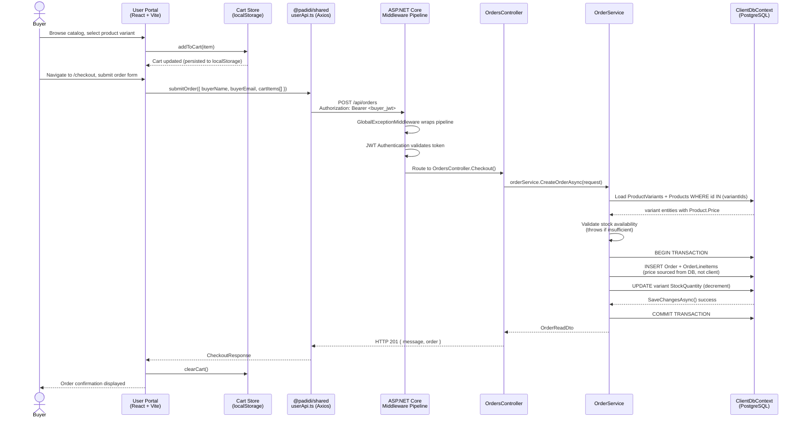
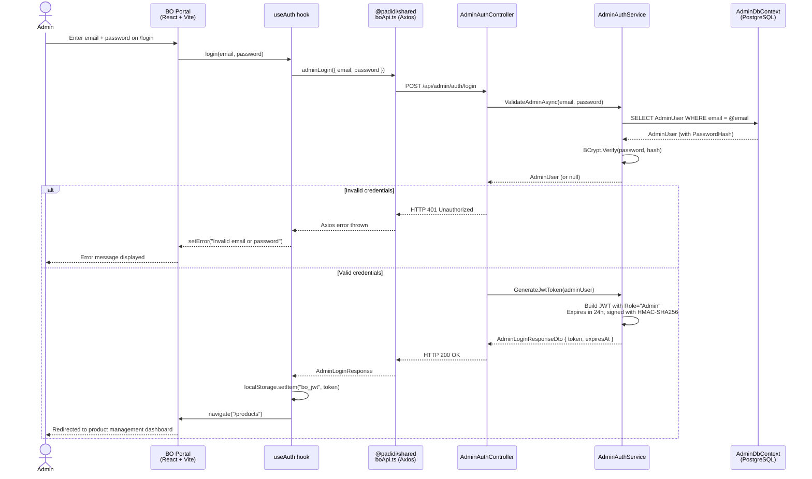

# PROJECT_DOCUMENTATION.md
## PADIDI — Fashion E-Commerce Platform

> Generated: March 20, 2026

---

## Table of Contents

1. [High-Level Architecture](#1-high-level-architecture)
2. [Directory Map](#2-directory-map)
3. [The Request Lifecycle](#3-the-request-lifecycle)
4. [Visual Flow (Mermaid)](#4-visual-flow-mermaid)
5. [Dependency & Tech Insights](#5-dependency--tech-insights)

---

## 1. High-Level Architecture

### Pattern: Layered / N-Tier Architecture (Monorepo)

PADIDI is a fashion e-commerce platform structured as a **monorepo** with a clear separation between two frontends and a shared backend API. The overall system follows a **Layered Architecture** pattern, where each tier has a well-defined responsibility and communicates only with the tier directly below it.

```
┌─────────────────────────────────────────────────────────┐
│                   PRESENTATION LAYER                    │
│  ┌──────────────────────┐   ┌───────────────────────┐  │
│  │   Back-Office Portal │   │    User/Shop Portal   │  │
│  │   (React + Vite)     │   │   (React + Vite)      │  │
│  └──────────┬───────────┘   └──────────┬────────────┘  │
│             │                          │                │
│             └─────────┬────────────────┘                │
│                       │  @padidi/shared (API + Types)   │
└───────────────────────┼─────────────────────────────────┘
                        │ HTTP (REST / JSON)
┌───────────────────────▼─────────────────────────────────┐
│                    API LAYER (Controllers)               │
│             ASP.NET Core 8 Minimal Host                  │
├─────────────────────────────────────────────────────────┤
│              SERVICE LAYER (Business Logic)             │
│  Interfaces in Services/Interfaces/ + Implementations  │
├─────────────────────────────────────────────────────────┤
│              DATA LAYER (EF Core + PostgreSQL)          │
│   AdminDbContext (admin + ads)   ClientDbContext        │
│   (products, categories, orders, buyers)               │
└─────────────────────────────────────────────────────────┘
```

### Core Philosophy

| Principle | How It's Applied |
|-----------|-----------------|
| **Separation of Concerns** | Controllers only route; Services own all business rules; DbContexts are split by domain |
| **Dual-Database Segregation** | `AdminDb` (admin users, ads) is kept entirely separate from `ClientDb` (catalog, orders, buyers), reducing blast radius if one is compromised |
| **Interface-Driven DI** | Every service is registered and consumed through an interface (`IProductService`, `IOrderService`, etc.), enabling easy testing and substitution |
| **Shared Package Contract** | `@padidi/shared` is the single source of truth for API call functions and TypeScript types across both frontends — no duplication |
| **Price Integrity** | Order totals are always calculated server-side from the database (`variant.Product.Price`), never trusted from the client request |
| **Fail-Safe via Middleware** | A global exception middleware translates all domain exceptions (e.g., `KeyNotFoundException`, `InvalidOperationException`) into consistent JSON error responses |

---

## 2. Directory Map

```
d:\project\Padidi_Complete\
│
├── package.json                  # NPM workspace root — orchestrates all apps and packages
├── start-dev.bat                 # Convenience script to start all services locally
│
├── apps/                         # Frontend applications (each is an independent Vite/React app)
│   ├── bo-portal/                # Back-Office portal for admin operations (CRUD, order management)
│   │   ├── vite.config.ts        # Vite build config with TailwindCSS v4 and React plugins
│   │   └── src/
│   │       ├── App.tsx           # Root component — mounts the router tree
│   │       ├── router/           # Declares all routes; enforces the JWT-gate via ProtectedRoute
│   │       ├── pages/            # One page-component per route (LoginPage, ProductsPage, etc.)
│   │       ├── components/       # Reusable UI components and layout shell (BoLayout)
│   │       └── hooks/            # Custom React hooks (useAuth — login/logout/state)
│   │
│   └── user-portal/             # Customer-facing storefront for browsing, cart, and checkout
│       ├── vite.config.ts        # Vite build config with TailwindCSS v4 and React plugins
│       └── src/
│           ├── App.tsx           # Root component — mounts the router tree
│           ├── router/           # Declares all public routes (catalog, product, cart, checkout)
│           ├── pages/            # One page-component per route (CategoryPage, CartPage, etc.)
│           ├── components/       # Reusable UI components including global Header
│           ├── hooks/            # Custom React hooks (useAuth — buyer login/logout/state)
│           └── store/            # Client-side cart state management (localStorage-based)
│
├── packages/
│   └── shared/                   # Internal NPM package (@padidi/shared) consumed by both apps
│       └── src/
│           ├── index.ts          # Barrel export for all API functions and types
│           ├── api/
│           │   ├── boApi.ts      # All Axios API calls for the Back-Office portal
│           │   └── userApi.ts    # All Axios API calls for the User portal
│           └── types/            # TypeScript interfaces/types for all domain entities
│               ├── admin.ts      # Admin user and auth DTOs
│               ├── product.ts    # Product, category, and variant types
│               ├── order.ts      # Order and checkout types
│               ├── buyer.ts      # Buyer auth and profile types
│               ├── ad.ts         # Advertisement types
│               └── about.ts      # About page content types
│
├── backend/
│   └── PADIDI.API/               # ASP.NET Core 8 Web API — the single backend for both portals
│       ├── Program.cs            # Application entry point: DI registration, middleware pipeline, EF migrations
│       ├── Controllers/          # HTTP API surface — thin request/response handlers only
│       ├── Services/             # All business logic; injected via interfaces
│       │   └── Interfaces/       # Service contracts (IProductService, IOrderService, etc.)
│       ├── Data/                 # EF Core DbContexts and configuration
│       │   ├── AdminDbContext.cs # Manages AdminUser and Ad entities
│       │   ├── ClientDbContext.cs# Manages Product, Category, Order, Buyer entities
│       │   ├── SeedData.cs       # Seeds a default admin user on first run
│       │   ├── AdminDb/          # EF configuration classes and migrations for AdminDb
│       │   └── ClientDb/         # EF configuration classes and migrations for ClientDb
│       ├── Models/               # Entity classes (plain C# classes mapped to DB tables)
│       ├── DTOs/                 # Data Transfer Objects for API requests and responses
│       ├── Mappings/             # AutoMapper profiles bridging Models ↔ DTOs
│       └── Middleware/           # GlobalExceptionMiddleware for unified error handling
│
├── uploads/                      # Runtime folder for user-uploaded images (served as static files)
└── specs/                        # Feature specifications, architecture plans, and task checklists
```

---

## 3. The Request Lifecycle

This section traces a complete end-to-end request through the system, using **"Admin creates a new Product"** as the canonical example.

### Step 1 — User Interaction (Back-Office Portal)
A logged-in admin fills out the "New Product" form in the **bo-portal** React app (`ProductsPage.tsx`). On submit, the page calls `createProduct()` from `@padidi/shared/api/boApi`.

### Step 2 — Outbound HTTP (Shared API Layer)
`boApi.ts` holds an **Axios instance** pre-configured with `VITE_BO_API_BASE_URL`. A **request interceptor** silently attaches the `bo_jwt` token from `localStorage` as an `Authorization: Bearer <token>` header before the request is dispatched.

```
POST http://localhost:<port>/api/products
Authorization: Bearer <JWT>
Content-Type: application/json
Body: { name, description, price, categoryId, variants[], imagePath }
```

### Step 3 — Middleware Pipeline (ASP.NET Core)
The request enters the ASP.NET Core pipeline defined in `Program.cs`:

1. `GlobalExceptionMiddleware` wraps the pipeline in a `try/catch` to intercept any unhandled exceptions.
2. `UseCors()` validates the `Origin` header against the allowed origins (`localhost:5173`, `localhost:5174`).
3. `UseAuthentication()` parses and validates the JWT — confirms signature, issuer, audience, and expiry.
4. `UseAuthorization()` checks that the `Role` claim equals `"Admin"` for `[Authorize(Roles = "Admin")]` endpoints.

### Step 4 — Controller (Routing & Delegation)
`ProductsController.cs` receives the bound `ProductCreateDto`. It performs no business logic — it immediately delegates to the injected `IProductService`:

```csharp
[HttpPost]
[Authorize(Roles = "Admin")]
public async Task<ActionResult<ProductReadDto>> Create([FromBody] ProductCreateDto dto)
{
    var product = await _productService.CreateAsync(dto);
    return CreatedAtAction(nameof(GetById), new { id = product.Id }, product);
}
```

### Step 5 — Service Layer (Business Logic)
`ProductService.CreateAsync()` performs all domain validation:
- Verifies the referenced `CategoryId` exists in the database.
- Constructs the `Product` aggregate with its `ProductVariant` children.
- Persists the entity via `ClientDbContext`.
- Re-fetches the saved entity (with navigation properties included) and returns a mapped `ProductReadDto`.

### Step 6 — Data Layer (EF Core + PostgreSQL)
`ClientDbContext` translates the LINQ operations into parameterized SQL queries (via Npgsql). EF Core handles:
- **Insert** of the `Product` row and all associated `ProductVariant` rows in a single `SaveChangesAsync()` call.
- **Auto-applied Migrations** — on startup in development, `Database.MigrateAsync()` is called, so schema changes deploy automatically.

### Step 7 — Response Flow (Back up the stack)
1. `ProductService` returns a `ProductReadDto` (mapped by AutoMapper).
2. `ProductsController` wraps it in `CreatedAtAction` (HTTP 201).
3. Any unhandled exception at any step is caught by `GlobalExceptionMiddleware`, which maps exception types to HTTP status codes and writes a structured JSON error.
4. The Axios response arrives back at the **bo-portal**; on success the UI refreshes the product list.

---

## 4. Visual Flow (Mermaid)

### Primary Happy Path: Buyer Places an Order



### Secondary Flow: Admin Login (Back-Office)



---

## 5. Dependency & Tech Insights

### Backend (ASP.NET Core 8)

| Library / Framework | Version | Role |
|---|---|---|
| **ASP.NET Core 8** | 8.x | Web API host, routing, middleware pipeline, DI container |
| **Entity Framework Core** | 8.x | ORM for all DB access; code-first migrations |
| **Npgsql.EntityFrameworkCore.PostgreSQL** | 8.x | EF Core provider for PostgreSQL |
| **AutoMapper** | 12.x | Maps between domain Models and DTOs via profile classes |
| **Microsoft.AspNetCore.Authentication.JwtBearer** | 8.x | JWT middleware for validating incoming Bearer tokens |
| **Microsoft.IdentityModel.Tokens** | 7.x | Low-level JWT creation, signing via HMAC-SHA256 |
| **BCrypt.Net-Next** | 4.x | Password hashing and verification (bcrypt, workFactor: 12) |
| **Swashbuckle (Swagger)** | 6.x | Auto-generated OpenAPI UI available in Development mode |

#### Hidden Backend Logic

- **Dual DbContext Segregation**: `AdminDbContext` and `ClientDbContext` point to entirely separate PostgreSQL databases (`padidi_admin`, `padidi_client`). This is a deliberate security boundary — compromise of the client database does not expose admin credentials.
- **Auto-Migration on Startup**: In development (`app.Environment.IsDevelopment()`), both DbContexts call `Database.MigrateAsync()` at startup. This means the schema is always kept in sync without manual `dotnet ef database update` commands.
- **Seed Admin Guard**: `SeedData.SeedDefaultAdminAsync()` only inserts the default admin if the `AdminUsers` table is empty (`AnyAsync()` check), making it idempotent and safe on every restart.
- **Price Security in OrderService**: The `CreateOrderAsync` method intentionally ignores any price data from the client request. It loads `variant.Product.Price` directly from PostgreSQL. This is an explicitly documented security measure preventing price manipulation attacks.
- **Transaction on Checkout**: Order creation is wrapped in `await using var transaction = await _db.Database.BeginTransactionAsync()`. This ensures that if stock decrement fails mid-order, the entire operation is atomically rolled back.
- **Static File Mount**: The `uploads/` folder at the repository root is mounted as a virtual `/uploads` endpoint, enabling uploaded product images to be served directly by the ASP.NET Core host without a CDN or separate file server.

---

### Frontend (React 19 + TypeScript + Vite 6)

| Library / Framework | Version | Role |
|---|---|---|
| **React 19** | 19.x | UI rendering, component model, hooks |
| **React Router v7** | 7.x | Client-side routing for both portals |
| **Axios** | 1.7.x | HTTP client for REST API calls; configured with interceptors |
| **TailwindCSS v4** | 4.x | Utility-first CSS framework (Vite plugin integration) |
| **TypeScript** | 5.7.x | Static typing across all source files |
| **Vite 6** | 6.x | Build tool and dev server with HMR |

#### Hidden Frontend Logic

**`@padidi/shared` — The Cross-Portal Contract Package**

The `packages/shared` workspace package is the most critical architectural "hidden" mechanism. Neither portal directly defines its own API functions or TypeScript types; both consume them exclusively from `@padidi/shared`. This ensures:
- A single location for API base URL configuration (via `import.meta.env.VITE_BO_API_BASE_URL` / `VITE_USER_API_BASE_URL`).
- A single location for all TypeScript type definitions, preventing type drift between portals.
- Axios request interceptors that silently inject JWT tokens (reading `bo_jwt` or `buyer_jwt` from `localStorage`) on every outbound request.

**`cartStore.ts` — Per-User Cart Isolation**

The cart is stored in `localStorage` but uses a dynamic key strategy:
```
Key: "padidi_cart"           → anonymous / guest user
Key: "padidi_cart_<buyerId>" → authenticated buyer (from buyer_info in localStorage)
```
This means a logged-in buyer's cart is preserved across browser sessions and is isolated from the guest cart, preventing cart data from leaking between sessions.

**`useAuth` Hooks — Dual-Portal Pattern**

Both portals implement a `useAuth` hook, but with different concerns:
- **`bo-portal/useAuth`**: Stateless check (`!!localStorage.getItem('bo_jwt')`); handles login async flow with loading/error states; navigates on success.
- **`user-portal/useAuth`**: Maintains a `currentBuyer: BuyerProfile | null` React state (hydrated from `localStorage`); exposes `getBuyerName()` and `getBuyerEmail()` convenience helpers used by the `Header` component.

**`ProtectedRoute` in BO Portal Router**

The back-office router implements a simple inline `ProtectedRoute` component. Unlike a library approach, it reads `localStorage.getItem('bo_jwt')` directly on render. If the token is absent, it immediately redirects to `/login`. There is no token expiry validation on the client side — the API will return a `401` on the next request if the token has expired, at which point the user must log back in.

**No Global State Library**

Neither portal uses Redux, Zustand, Jotai, or any external state management library. State is managed through:
1. React component-local `useState` / `useReducer`.
2. `localStorage` for persistence (JWT tokens, buyer profile, cart).
3. Custom hooks (`useAuth`) that wrap `localStorage` reads with a React state layer.

This is intentional for simplicity given the project's scope, but means there is no reactive cross-component cart count update without a page-level re-render or prop drilling.

---

### Infrastructure & Configuration

| Concern | Solution |
|---|---|
| **Database** | PostgreSQL (two separate databases per domain) |
| **Authentication** | JWT Bearer tokens, HMAC-SHA256, 24-hour expiry for Admin; role-based (`Admin`, `Buyer`) |
| **Password Storage** | BCrypt with workFactor 12 |
| **CORS** | Explicitly configured to allow only `localhost:5173` and `localhost:5174` |
| **Environment Config** | `appsettings.Development.json` for backend; Vite `.env` variables (`VITE_*`) for frontends |
| **Monorepo Management** | NPM Workspaces (`"workspaces": ["apps/*", "packages/*"]`) — no Nx or Turborepo |
| **API Documentation** | Swagger UI auto-enabled in Development via Swashbuckle |
| **Image Uploads** | Served from the `uploads/` root folder mounted as `/uploads` static endpoint |
